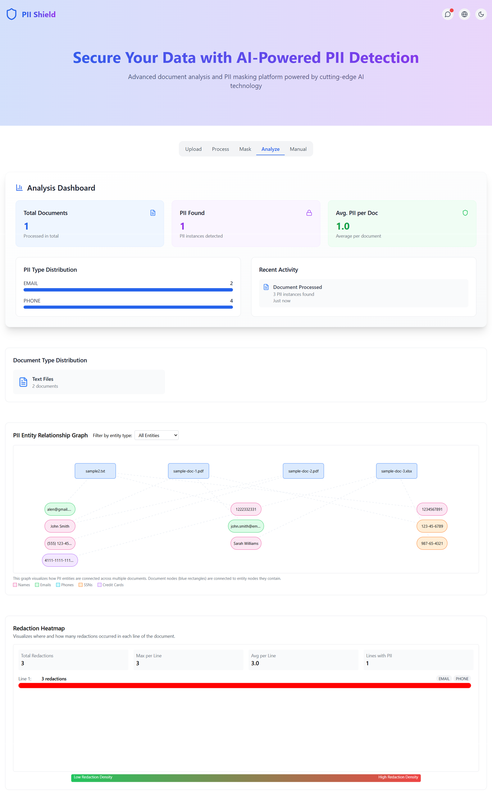
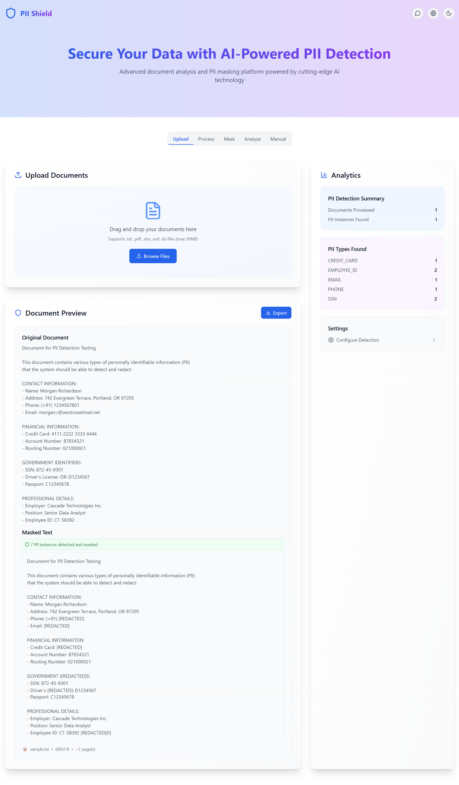
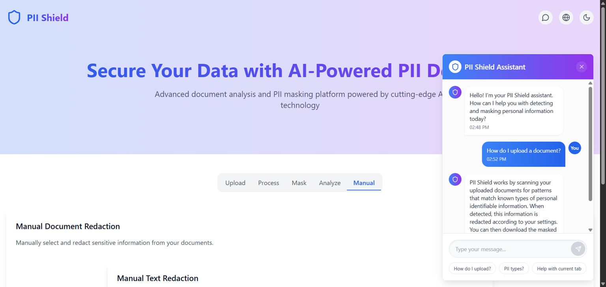

# PII Detection & Redaction Tool

A powerful web application for detecting and redacting Personally Identifiable Information (PII) from documents, with support for multiple file formats and real-time visualization.

## 🎯 Features

- **Multi-Format Support**: PDF, images, Excel, text files
- **Smart PII Detection**: Uses Hugging Face NER model with regex-based fallback
- **Real-Time Redaction**: Mask sensitive information instantly
- **Visual Analytics**: Entity graphs and heatmaps for insights
- **Dark Mode**: Comfortable viewing in any lighting condition
- **Multi-Language Support**: English, Spanish, French, Hindi, Urdu, Kannada
- **Export Options**: Download redacted documents in multiple formats

## 📸 Screenshots

### Dashboard



### Frontend Interface



### Chatbot Assistant



## 🚀 Quick Start

### Prerequisites

- Node.js 18+
- npm or yarn

### Installation

1. Clone the repository

```bash
git clone https://github.com/MRRTX99/PII-Shield.git
cd PII-Shield
```

2. Install dependencies

```bash
npm install
```

3. Setup environment variables

```bash
# Copy the example file
cp .env.example .env

# Add your Hugging Face API key
# Model: dslim/bert-base-NER (BERT-based Named Entity Recognition)
# Get your token from: https://huggingface.co/settings/tokens
```

4. Start the development server

```bash
npm run dev
```

5. Open your browser and navigate to local host

## 📦 Build for Production

```bash
npm run build
```

## 🔧 Available Scripts

- `npm run dev` - Start development server
- `npm run build` - Build for production
- `npm run preview` - Preview production build
- `npm run lint` - Run ESLint

## 🛡️ Security

- All API keys are stored in `.env` (never committed to Git)
- Use `.env.example` as a template for configuration
- Sensitive data is processed client-side when possible

## 🧠 PII Detection Types

The tool detects:

- Email addresses
- Phone numbers
- Social Security Numbers (SSN)
- Addresses
- Credit card numbers
- Bank account numbers
- Employee IDs
- Names (in various formats)

## 🔌 Tech Stack

- **Frontend**: React 18 + TypeScript
- **Build Tool**: Vite
- **Styling**: Tailwind CSS + PostCSS
- **Visualization**: Cytoscape.js, Chart.js
- **API Integration**: Hugging Face Inference API
- **PDF Processing**: pdfjs-dist, jsPDF
- **UI Components**: Lucide React, Framer Motion
- **Notifications**: React Hot Toast

## 📄 Project Structure

```
src/
├── api.ts                 # PII detection logic
├── App.tsx               # Main application component
├── fileUtils.ts          # File processing utilities
├── types.ts              # TypeScript definitions
├── components/           # React components
│   ├── ManualRedaction.tsx
│   ├── PiiEntityGraph.tsx
│   └── RedactionHeatmap.tsx
└── store/               # State management
    └── useBoardStore.ts
```

## 🤝 Contributing

Contributions are welcome! Please feel free to submit a Pull Request.

## 📝 License

This project is part of the PII-Shield repository.

## 👤 Author

**MRRTX99** - [GitHub Profile](https://github.com/MRRTX99)

## 📧 Support

For issues and questions, please open an issue on GitHub.

---

**Note**: This tool helps identify sensitive information in documents. Always handle PII with care and follow your organization's data protection policies.
